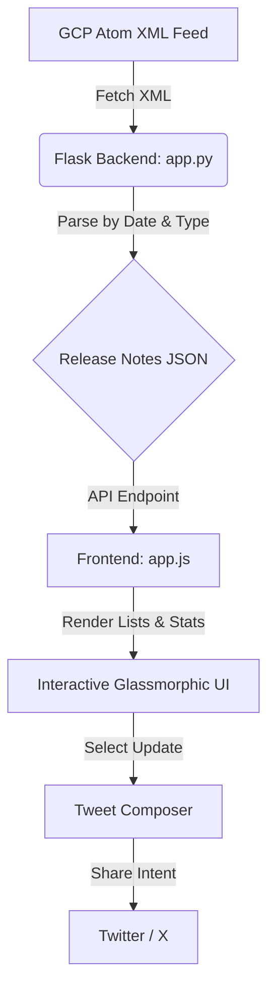

# BigQuery Release Notes Explorer 🚀

A web application designed to fetch, filter, search, and Tweet about Google Cloud BigQuery release notes. It parses the official Atom XML release notes feed, splits updates into individual items, and presents them in a responsive dark-themed dashboard.

---

## 🎨 Main Features

- **Atom Feed Ingestion**: Connects to the GCP release notes feed and parses entries dynamically.
- **Granular Splitting**: Separates combined daily release note summaries into single category-based cards.
- **Type Classification**: Badges and styles each card based on its update type (*Feature*, *Issue*, *Breaking*, *Announcement*, or *Change*).
- **Interactive Counters**: Displays live stats in the sidebar that double as quick filters when clicked.
- **Live Search & Category Filters**: Quickly find updates by keyword or filter them by type.
- **Tweet Composer**:
  - Automatically drafts a formatted tweet with a character count estimation.
  - Features a custom **SVG Character Progress Wheel** that animates as you type.
  - Supports quick posting to X (formerly Twitter) using Web Intents.

---

## 💻 Tech Stack

- **Backend**: Python 3, Flask
- **Frontend**: Vanilla HTML5, CSS3 (variables, transitions, glassmorphic effects), Javascript (ES6+)
- **Icons**: Lucide Icons CDN
- **Fonts**: Outfit, Inter, and JetBrains Mono (via Google Fonts)

---

## 🏗️ Architecture



---

## 📁 Project Structure

```text
bigquery-release-notes/
├── app.py              # Main Flask server, Atom scraper, and XML parser
├── templates/
│   └── index.html      # Glassmorphic layout grid, stats cards, and composer UI
├── static/
│   ├── style.css       # Custom dark CSS theme variables and responsive styles
│   └── app.js          # Client-side state engine, rendering, and tweet counts
├── .gitignore          # Excludes caches, venv folders, and IDE settings
└── README.md           # Project documentation (this file)
```

---

## 🚀 Setup & Execution Guide

### Prerequisites
Make sure you have **Python 3** installed on your system.

### 1. Clone or Copy the Project
Ensure all files are arranged inside the project folder:
```text
C:\Users\bhask\bigquery-release-notes\
```

### 2. Install Flask
Open your command prompt or PowerShell and run:
```bash
pip install flask
```

### 3. Start the Flask Server
Run the application using:
```bash
python app.py
```
Or use Flask commands:
```bash
flask run --port=5000
```

### 4. Open in Browser
Once the server starts up, navigate to:
👉 **[http://127.0.0.1:5000](http://127.0.0.1:5000)**

---

## 🤝 Contributing
Feel free to fork this project, suggest improvements, or submit pull requests for additional features!
